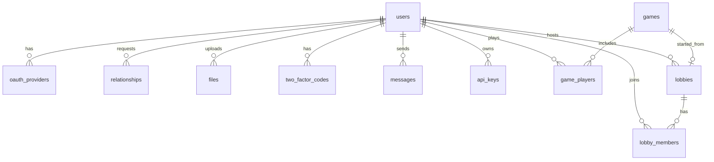

# Transcendence

*42 curriculum project by jwardeng, ksinn, nmannar, and rmakoni.*

## Description

Transcendence is a web-based Tetris built as a full-stack SPA: accounts, social features, and live multiplayer around a Tetris Guideline–faithful engine.

Players can run Marathon, Sprint, and Ultra, or create a lobby and play with up to four people over WebSockets. The site also covers profiles, friends, chat, optional email 2FA, leaderboards, match history, achievements, and a documented public API. Everything the browser talks to is served over HTTPS.

## Getting started

```bash
make up
```

Open **https://localhost:8443**. The browser will warn about Caddy’s self-signed certificate; continue past it (Advanced → Proceed / Accept the Risk).

Host port **8443** maps to Caddy’s HTTPS port 443 inside Docker. REST, the public API, Swagger, uploads, and WebSockets all go through that HTTPS/WSS endpoint. Port 8080 only redirects to HTTPS. Ports 8080 and 5173 are not meant for the browser.

```bash
make down    # stop containers
make logs    # tail logs
make help    # other targets
```

## Resources

- [Go](https://go.dev/doc/)
- [Chi](https://github.com/go-chi/chi)
- [Vue.js](https://vuejs.org/guide/introduction.html)
- [Tailwind CSS v4](https://tailwindcss.com/docs)
- [MDN (HTML & CSS)](https://developer.mozilla.org/en-US/docs/Web)
- [OpenAPI](https://spec.openapis.org/oas/v3.1.0.html)
- [Swagger](https://swagger.io/specification/)

Tutorials used:

- [Vue / frontend](https://www.youtube.com/watch?v=iX8g4LqF8p8&list=PLLXLQba2wc-A&index=3)
- [Vue / frontend](https://www.youtube.com/watch?v=BkzgYfygDy8&list=PLLXLQba2wc-A&index=4)
- [Vue / frontend](https://www.youtube.com/watch?v=W4njY-VzkUU&list=PLLXLQba2wc-A&index=6)
- [Vue / frontend](https://www.youtube.com/watch?v=5oKpoqmUj64&list=PLLXLQba2wc-A&index=13)

AI usage: Go tests, documentation

## Team Information

**jwardeng** — Developer. Implements assigned features (public API, gamification), reviews pull requests, and tests their work.

**ksinn** — Product Owner and Developer. Maintains the product backlog, implements the Go backend (auth, users, friends, uploads, tests), reviews pull requests, and tests their work.

**nmannar** — Developer. Implements assigned features (email 2FA, friends chat), reviews pull requests, and tests their work.

**rmakoni** — Project Manager, Technical Lead, and Developer. Organizes planning, keeps the team aligned, decides the technology stack, and implements the Vue frontend, Tetris engine, match WebSockets, and lobby backend.

## Project Management

Work was planned in regular check-ins: we listed what was still unfinished, assigned owners, and merged through GitHub pull requests. Day-to-day discussion happened on Discord.

- **Tools:** GitHub and pull requests
- **Communication:** Discord

## Technical Stack

| Layer | Technologies |
| --- | --- |
| Frontend | Vue 3, Vite, Pinia, Vue Router, vue-i18n (en / de / fr), Tailwind CSS v4 |
| Backend | Go, Chi, JWT |
| Database | PostgreSQL 17, Goose migrations |
| Infra | Docker Compose, Caddy (HTTPS / WSS) |
| Other | SendGrid (2FA mail), Swagger / OpenAPI |

**Why this stack**

- **Vue 3 + Vite + Pinia** — a typed SPA with fast reloads and a clear place for auth, lobby, and match state.
- **Go + Chi** — a small HTTP toolkit that fits REST handlers, JWT middleware, and a WebSocket hub without a heavy framework.
- **PostgreSQL 17** — relational integrity for users, friends, lobbies, and matches; UUID primary keys; JSONB for achievement flags.
- **Goose** — versioned SQL migrations checked into the repo.
- **Docker Compose + Caddy** — one-command local stack with HTTPS and WSS in front of the app.
- **JWT** — stateless session tokens for the SPA and WebSocket auth.
- **vue-i18n** — English, German, and French from the same UI.
- **Tailwind CSS v4** — utility classes on top of the existing BEM theme (Preflight disabled so the custom look stays intact).
- **SendGrid** — delivery for optional email 2FA codes.

## Database Schema

SQL in [`backend/migrations/`](./backend/migrations/) is the source of truth. Overview:



| Table | Purpose |
| --- | --- |
| `users` | Accounts: username, email, password hash, avatar, role, 2FA flag, `xp`, `achievements` JSONB, `last_seen_at` |
| `oauth_providers` | Linked OAuth identities (`provider`, `provider_user_id`) |
| `relationships` | Friend requests, friendships, and blocks (`requester_id`, `receiver_id`, `status`) |
| `games` | Match header (`mode`, `status`, timestamps) |
| `game_players` | Per-player score, lines, level, placement, winner flag |
| `files` | Uploaded avatars (path, mime type, size) |
| `lobbies` | Invite code, host, max players (2–4), status, optional `game_id`, `shared_seed`, `name` |
| `lobby_members` | Membership and ready state |
| `two_factor_codes` | Hashed email 2FA codes with expiry and purpose |
| `messages` | Friends-only chat body, `read_at` |
| `api_keys` | SHA-256 key hashes, name, last used, revoke timestamp |

## Features

| Area | What it does | Who |
| --- | --- | --- |
| Profiles | Avatar upload, username edit, language, optional 2FA, API keys, account deletion | ksinn, nmannar, jwardeng, rmakoni |
| Friends | Add / remove, accept / deny requests, block, 1-on-1 chat | ksinn, nmannar |
| Directory | Player list, public profiles, privacy policy, terms, credits | rmakoni |
| Game | Marathon, Sprint, Ultra, and multiplayer; music mute; Guideline engine | rmakoni |
| Lobbies | Create or join by invite code, 2–4 players, ready / host start | rmakoni |
| Stats | Leaderboard, player statistics, match history | ksinn, jwardeng |
| Gamification | XP bar, levels, badges / achievements | jwardeng |
| Internal API | [OpenAPI in Swagger UI](https://petstore.swagger.io/?url=https://raw.githubusercontent.com/Raainshe/Transcendence/refs/heads/main/openapi.yaml) | ksinn, jwardeng |
| Public API | [Swagger UI](https://localhost:8443/swagger/index.html) — API-key auth, rate limits, public DTOs | jwardeng |

## Modules

Major modules are 2 points each; minor modules are 1 point each.

### Major (16 points)

| Module | Pts | Who | How |
| --- | --- | --- | --- |
| Frontend + Backend Framework | 2 | Frontend: rmakoni; Backend: ksinn | Vue 3 + Vite SPA; Go + Chi REST API |
| WebSocket | 2 | rmakoni, nmannar | Match rooms (`player.state`, reconnect) and friends chat on the same hub |
| Interact with other users | 2 | nmannar, ksinn | Friend graph plus persistent 1-on-1 messaging |
| Public API | 2 | jwardeng | API keys, IP- and key-based rate limits, public DTOs, Swagger |
| Standard User Management | 2 | ksinn | Sign up / log in with hashed passwords and JWT |
| Game (web-based) | 2 | rmakoni | Browser Tetris engine (Guideline rules, four modes) |
| Remote players | 2 | rmakoni | Live opponent boards over match WebSockets |
| Multiplayer 3+ | 2 | rmakoni | Lobbies for 2–4 players, invite codes, ready / start |

### Minor (6 points)

| Module | Pts | Who | How |
| --- | --- | --- | --- |
| File Upload | 1 | ksinn | Avatar upload and stored files |
| Multi Browser support | 1 | rmakoni | SPA tested across Chromium and Firefox |
| Multi Language support | 1 | rmakoni | vue-i18n: English, German, French |
| Game Stats + Match History | 1 | ksinn, jwardeng | Persisted scores, leaderboard, history UI |
| 2FA | 1 | nmannar | Optional email codes (bcrypt hash, expiry, SendGrid) |
| Gamification | 1 | jwardeng | Achievements, badges, XP, and levels |

**Total: 22 points**

## Individual Contributions

### jwardeng

- Implemented the public API module, including the ability for a user to create an API key: the key is hashed with SHA-256 before being stored in the database. Added a two-phase rate limiter: one IP-based, which applies to unauthenticated traffic, and one API-key-based, used to prevent abuse and enforce per-key limits. The public endpoints mirror existing routes, so each resource has a public DTO that controls what is exposed. Documented the public API with Swagger (overview and try-out). Added a lobby-name field so the public PUT endpoint has a meaningful attribute to expose.
- Added gamification: persistent storage and visual feedback for achievements, badges, XP, and leveling. Achievements cover milestones such as score and total-points thresholds, level reached, games played/won, and actions such as adding a friend or changing an avatar. XP increases from unlocked achievements, wins, and games played. Badges give visual feedback for those achievements.
- **Challenges:** Joined the team later, so the main challenge was learning the codebase and stack. Learned Go during the project and got used to the frontend. It was a good experience thanks to the architecture already in place and Go’s C-like syntax.

### ksinn

- Implemented the Go backend: module layout, base structs, first SQL migrations, Chi router and route registration, JWT auth middleware, and auth / user / game handler–service layers.
- File uploads: avatar upload endpoint and the underlying file storage.
- OpenAPI specs.
- Friend system: model, database layer, service functions, and routes.
- Backend unit test suite and integration test suite.
- Cleanup / best practices: unified error responses, stopped silently swallowing errors, tightened password policy, capped request body size, and made database health checks log and continue instead of failing hard.
- User online status: added a last-seen claim to JWTs.

### nmannar

- Implemented optional email 2FA. On the backend, extended AuthService with bcrypt-hashed 6-digit codes (10-minute expiry), an SMTP mailer, and a verification step for login. On the frontend, built the two-step login and the enable/disable 2FA controls on the profile page. Delivery goes through SendGrid.
- Built persistent 1-on-1 messaging between friends. On the backend, added a chat service that enforces friends-only access, validates and length-caps messages, and sends them over the existing WebSocket hub. History and unread counts are stored. On the frontend, built ChatView (conversation sidebar and message thread).
- **Challenges:** In chat, clicking Send did nothing. Tracing it in the browser inspector showed a Go nil slice that made `.map()` throw on the frontend before the socket connected. Had little prior experience with Go, TypeScript, Vue, and SQL.

### rmakoni

- Built most of the Vue frontend: routing, layout, menus, play view, HUD, and the lobby/match UI on Pinia and the existing auth/i18n stack.
- Designed the Tetris engine as framework-agnostic TypeScript, following the Tetris Guideline: 7-bag generation, SRS wall-kicks, DAS/ARR input, extended lock-down, gravity/levels, Hold, ghost piece, Guideline scoring, T-Spins, Back-to-Back, and Marathon / Sprint / Ultra / multiplayer variants.
- Implemented remote multiplayer over WebSockets. Clients stream `player.state` (board, score, lines) into a match room; opponents render live on the play view, with reconnect/backoff and elimination / match-ended handling.
- On the backend, built lobby flow: create and join by invite code (2–4 players), ready/start gates, host-only start, and handing the lobby off onto a match WebSocket room when the game begins.
- **Challenges:** The engine was the hardest piece — logic bugs made the game behave incorrectly until the Guideline rules were implemented carefully. Match WebSockets were also difficult, and a more complex UI was dropped because it would have required a rewrite.
